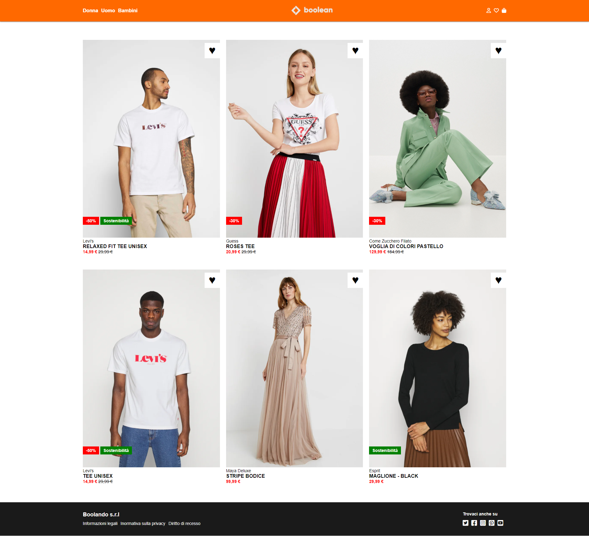

# Boolando E-commerce

## Overview
Boolando is a fictional e-commerce website showcasing various fashion products. This project demonstrates the use of HTML and CSS to build a responsive web page with modern design elements.

## Features
- 🛍️ **Product Listings**: Display fashion products with discounts and sustainability tags.
- 📱 **Responsive Design**: Optimized for both desktop and mobile devices.
- 🎨 **Stylish UI**: Modern design with a focus on usability.

## Technologies Used
- **HTML**: Structure of the website.
- **CSS**: Styling and layout.
- **Font Awesome**: Icons for user interface elements.

## Project Structure
- **Header**: Contains the logo, navigation links, and user icons.
- **Main Section**: Displays a grid of products with images, descriptions, and prices.
- **Footer**: Provides legal information and social media links.

## Screenshots
### Home Page

### Hover Effect

## How to Use
1. Clone the repository.
2. Open `index.html` in your web browser.
3. Explore the various sections and features.